# 插件使用文档

本插件目前为开发测试阶段，尚未签名，请勿用于生产环境。

## 启用 Discover-App 插件
登录 Grafana 并启用插件，在 Plugins 中找到 Discover-App，点击 Enable

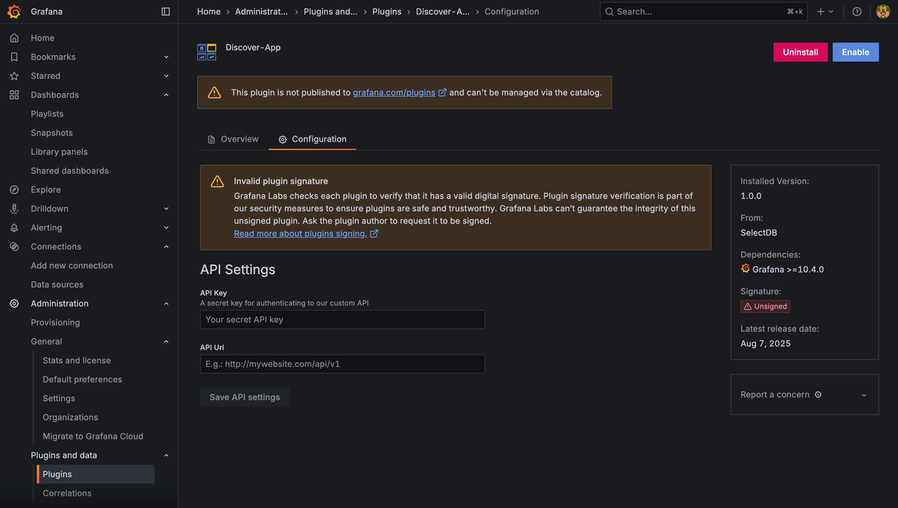

### 添加数据源
在 Data sources 中为 Doris 增加数据源


## Discover 日志检索功能

### 界面

Discover 界面类似于 Kibana Discover 页面，为日志检索进行深度体验优化，分为 4 个区域：
- 顶部的输入区：选择集群、表、时间字段、查询的时间段，主输入框支持关键词检索和 SQL 两种模式。
- 左侧的字段展示和选择区：展示当前表的所有字段，可以选择哪些字段在右边的明细展示区显示，鼠标悬停在字段上会展示这个字段出现最多的 5 个值和出现比例，还可以进一步按值筛选，筛选条件体现在输入区的筛选部分。
- 中间的趋势图展示和交互区：按照一定的时间间隔展示满足条件的日志条数，用户可以在趋势图上框选一段时间来调整查询时间段。
- 下方的明细数据展示和交互区：展示日志明细，可以点开查看某条日志的明细，支持表格和 JSON 两种格式，表格形式还支持交互式创建筛选条件

依次选择数据源、Database和Table，Discover会自动查询表中的字段并选中第一个时间字段。


### 显示字段比例
鼠标点击在左侧 service_name 字段，展示最高频的 service_name ，同时也可以查看占比。

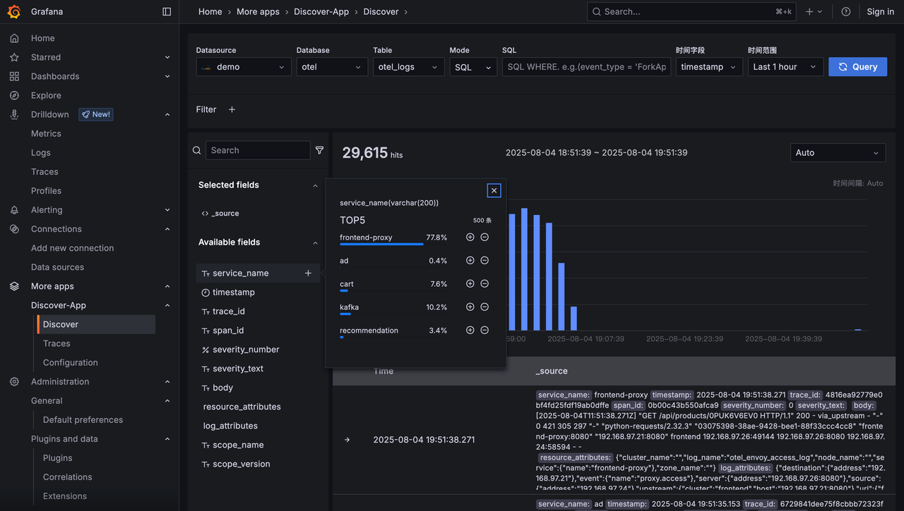

还可以通过点击 加号（+） 或者减号（—）按钮，创建筛选条件，比如通过点击 service_name 值 为 kafka 右侧加号（+）按钮，筛选条件中显示 service_name = 'kafka'

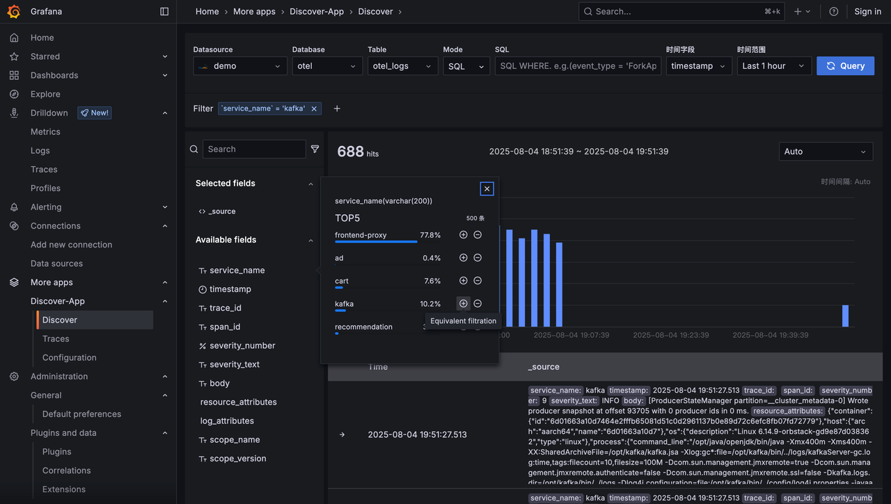


### 通过搜索过滤结果

在主输入框使用搜索和 SQL 两种模式查询关键字。

```
只有有倒排索引的表才支持搜索模式。参考：https://doris.apache.org/zh-CN/docs/table-design/index/inverted-index
```

在搜索框下面，选择搜索，然后在右侧输入 kafka ，单击查询，在搜索模式下，搜索包含关键词 kafka 的日志，明细中的 kafka 会高亮显示，趋势图的数据条数对应变化。

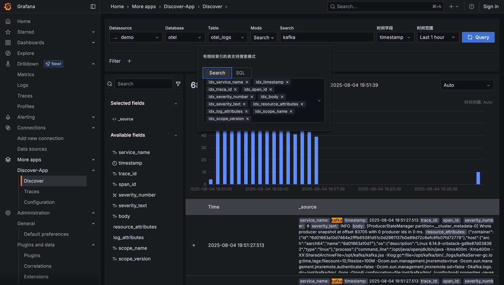


搜索我们使用匹配任意一个关键字的 MATCH_ANY 语句，可以匹配到日志中任意一个字段。

请注意，搜索结果的高亮会尽可能匹配所有搜索的关键词，但由于一些特殊字符，并不总是能够和搜索关键字完全匹配。

可以在搜索中使用双引号包裹短语，比如 "frontend-proxy"。将会整匹配整个短语。短语使用了 MATCH_PHRASE 来匹配短语。

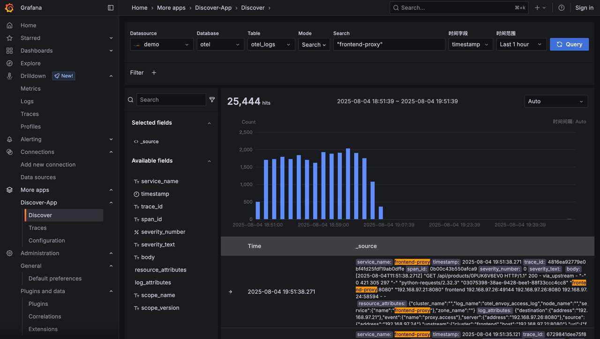

如果你对搜索原理或者对 MATCH_ANY、MATCH_PHRASE 还有疑问，请参考文档 倒排索引。

如果需要更精确的匹配，可以使用 SQL 模式。

### 通过 SQL 过滤结果

在搜索框下面，选择 SQL，然后在 SQL 模式下，输入 SQL WHERE 条件 service_name = "kafka" ，单击查询，实现同样的效果。

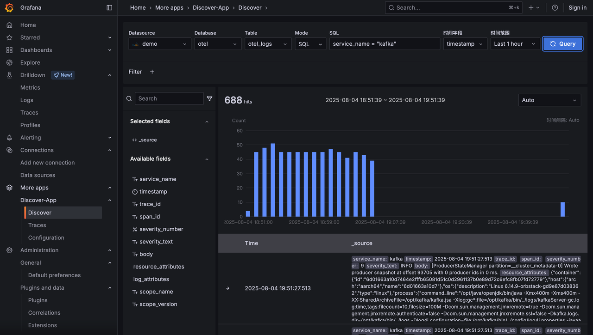

### 查看过滤结果明细
展开日志明细，可选 Table 或 JSON 格式，Table 格式支持交互式创建筛选条件。

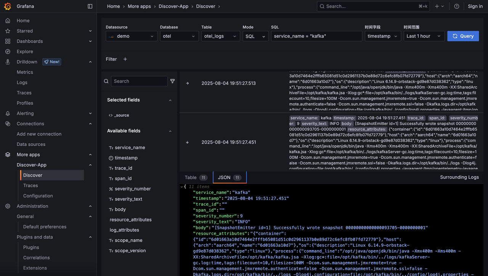

### 查看上下文并进一步检索
点击右侧Surrounding Logs可以查看这条日志前后 10 条日志，上下文检索中还可以继续添加过滤条件。


### 过滤 VARIANT 数据类型
在 Doris 2.1 中引入一种新的数据类型 VARIANT，它可以存储半结构化 JSON 数据。VARIANT 类型特别适用于处理复杂的嵌套结构，而这些结构可能随时会发生变化。

Studio 将会识别 VARIANT 数据类型，自动展开该数据类型的层级，并提供了特殊的过滤方式。

我们接下来展示如何过滤 VARIANT 数据类型的字段。

在过滤条件中，我们可以选择 VARIANT 数据类型的字段，并选择其中的子字段进行过滤。


检索到2条记录

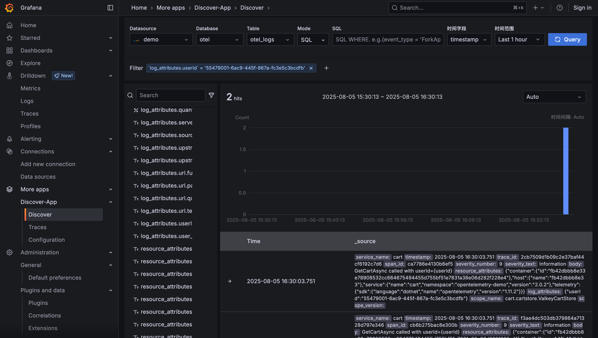

在 SQL 模式下，我们可以使用 [] 来访问 VARIANT 数据类型的字段。例如 `log_attributes["userId"] = "55479001-6ac9-445f-867a-fc3e5c3bcdfb"`
得到了相同的结果

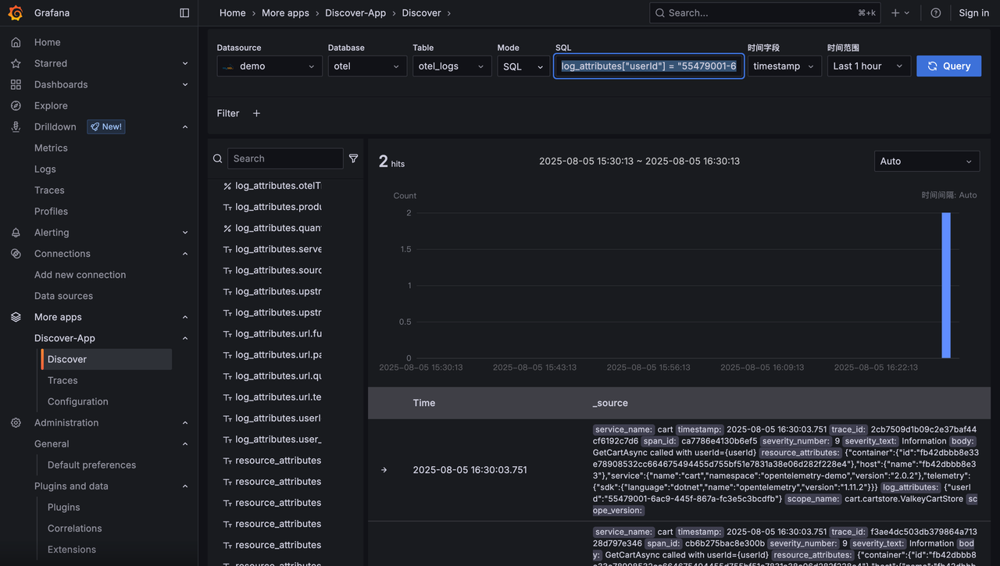

## FAQ

#### 为什么我看不到数据？
1. 请检查集群、表、时间字段是否选择正确。
2. 请检查时间段是否选择正确。
3. 请检查是否有筛选条件。
4. 
#### 我应该怎么为我的表创建倒排索引？
你可以在建表时置顶倒排索引，也可以在已有表上创建倒排索引。
请参考文档 管理索引。

#### 使用 Variant 类型存储数据有什么教程？
请参考文档 Variant 类型。

#### 上下文索引中的日志不够精确，有些日志找不到？
使用更高精度的 DateTime 字段，可以提高上下文索引的精确度。比如 DateTime(3)。

## Traces 功能
## 界面
上方：数据源、库表、时间字段、时间范围选择

左侧边栏：根据下图所示的条件进行过滤

右侧上方：Traces 的散点图，X 轴为时间，Y 轴为耗时、气泡的大小代表这个 Trace 包含的 span 数量

右侧下方：列表形式展示的 Traces，包括了排序、分页功能

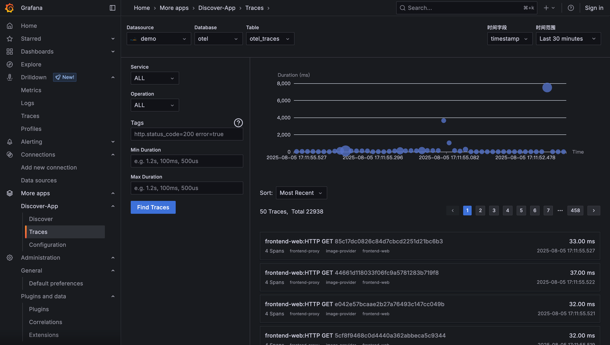

## 使用 Service 筛选
选择frontend-web

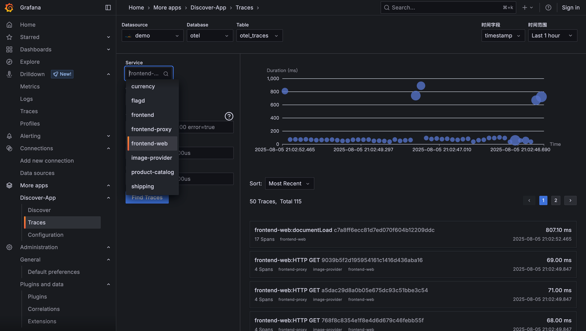

## 使用 Operation 筛选
选择 HTTP POST

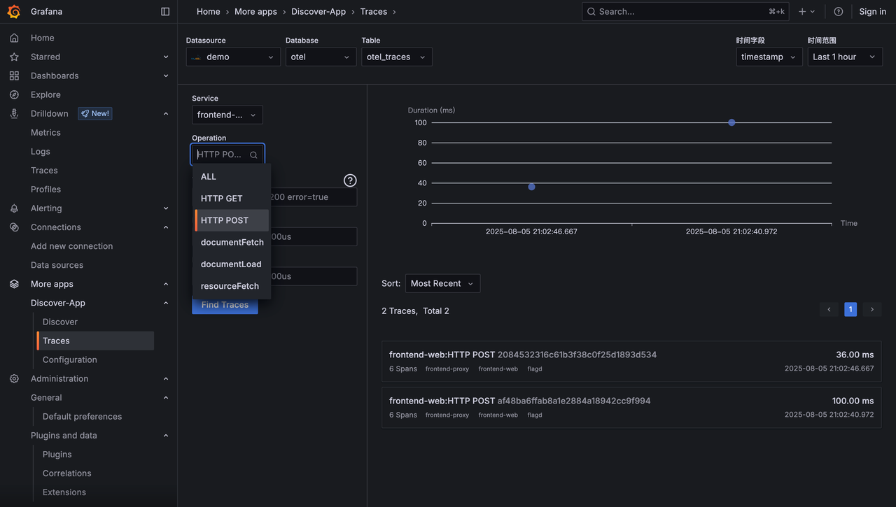

点击列表，显示 Trace 链路，通过上方的 Span Filters 进一步筛选

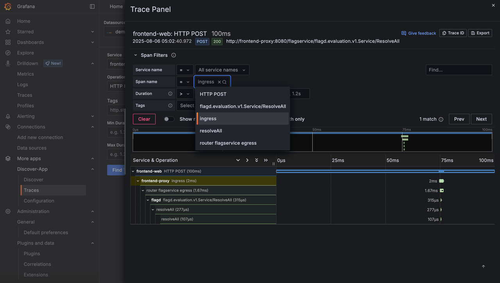

## 使用 Tags 筛选
使用 logfmt 语法，如 upstream_cluster.name="flagservice"，查找 span_attributes 中的属性

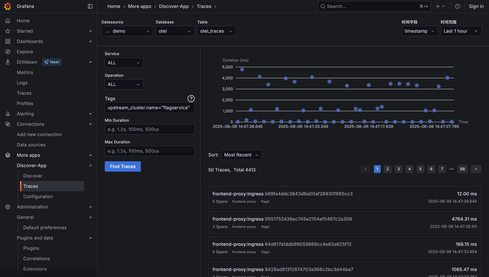

## 使用 Duration 筛选
可输入示例如 Min Duration / Max Duration为 1.2s，或者 100ms 等进行时间等筛选，筛选出特定耗时的 Trace

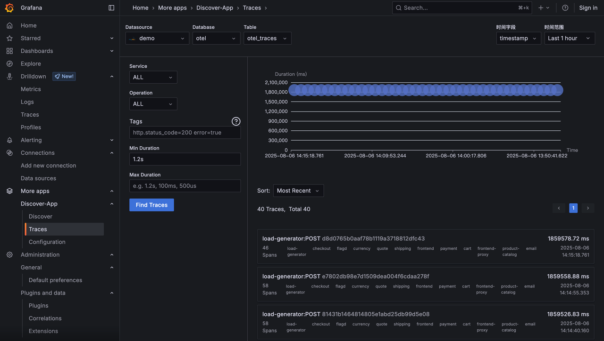

## 使用排序与分页
可以按最近、最长/最短耗时、最多/最少 Spans 排序结果，使用分页可以切换页码


